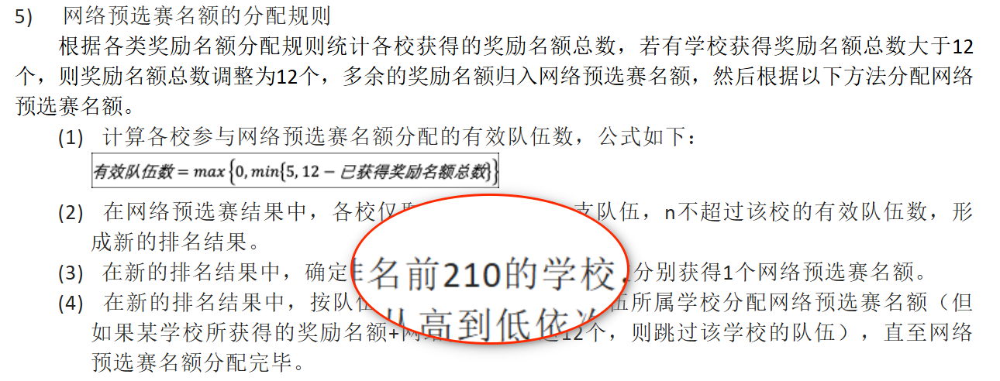
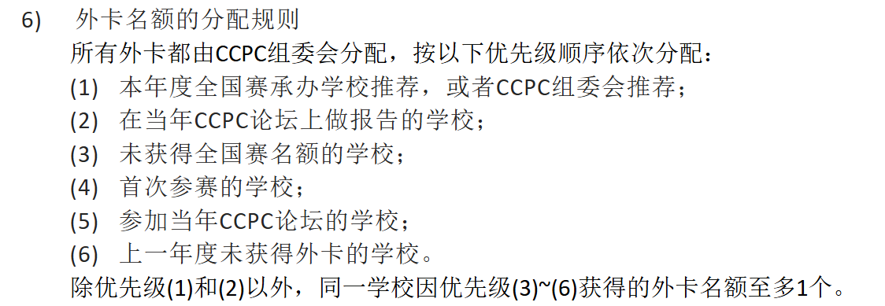
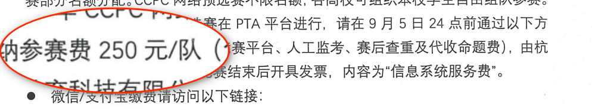

# CCPC 中国大学生程序设计竞赛

> **CCPC**（China Collegiate Programming Contest）是由教育部高等学校计算机类专业教学指导委员会主办的面向全国高校大学生的年度学科竞赛。

## 官方信息

| 项目 | 链接 |
| --- | --- |
| 2025 网络赛官方 | [ccpc.io/post/371](https://ccpc.io/post/371) |
| 基本规则 | [ccpc.io/rules](https://ccpc.io/rules)（不用细看） |
| 2025 名额分配规则 | [ccpc.io/rules/369](https://ccpc.io/rules/369) |

## 网络预选赛

### 题目链接

- 📝 [VJudge 题目链接（contest/751374）](https://vjudge.net/contest/751374)

### PTA 排行

- 📊 [PTA 排行（mooc.pintia.cn）](https://mooc.pintia.cn/rankings/1967841176776331264)

## 外卡 / 名额

## 参赛费

