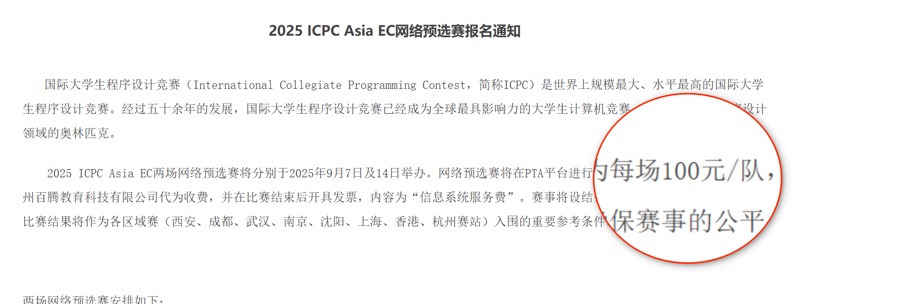
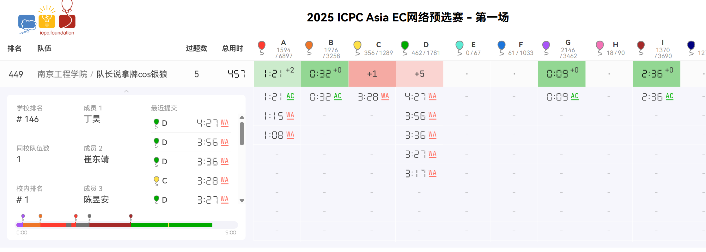
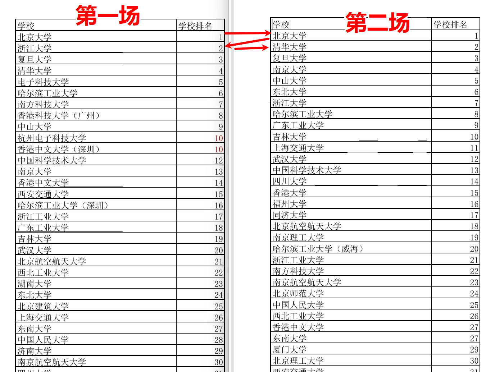

# ICPC 国际大学生程序设计竞赛

> **ICPC**（International Collegiate Programming Contest）由 ICPC 基金会举办，是最具影响力的大学生计算机竞赛，含金量最高的算法赛事之一。
>
> 北京总部：[icpc.pku.edu.cn](https://icpc.pku.edu.cn/)

## 参赛费

## 网络赛排名（PTA）

- [2025 ICPC Asia EC 网络预选赛 - 第一场](https://mooc.pintia.cn/rankings/1962439589388427264)
- [2025 ICPC Asia EC 网络预选赛 - 第二场](https://mooc.pintia.cn/rankings/1964904761885741056)

::: tip 举例
南京工程学院终排名 **181 名**，第一场 5 题，罚时几乎最前。
:::

## 网络赛题目链接

2025 ICPC 亚洲大陆中国区网络赛官方题目链接（QOJ 原赛场）：

| 场次 | 时间 | 题数 | QOJ 赛场 | VJudge 镜像 |
| --- | --- | --- | --- | --- |
| 第一场 Online I | 9.7 | 13 题 A~M | [qoj.ac/contest/2513](https://qoj.ac/contest/2513) | [vjudge.net/contest/748493](https://vjudge.net/contest/748493) |
| 第二场 Online II | 9.14 | 13 题 A~M | [qoj.ac/contest/2534](https://qoj.ac/contest/2534) | [vjudge.net/contest/748585](https://vjudge.net/contest/748585) |

::: tip 使用说明
- **QOJ** 为官方原赛场，题面中英文完整，榜单原始数据。
- **VJudge 镜像** 搬运全部题目，支持多语言提交、本地虚拟比赛，无需 QOJ 账号即可做题。
:::

## 网络赛校排名额汇总（民间最终版）

### 各赛区名额

| 赛区 | 校排名 | 名额 |
| --- | --- | --- |
| 西安 | 1–80 | 2 |
| 西安 | 81–150 | 1 |
| 成都 | 1–160 | 1 |
| 武汉 | 1–100 | 2 |
| 武汉 | 101–200 | 1 |
| 南京 | 1–160 | 1 |
| 沈阳 | 1–100 | 2 |
| 沈阳 | 101–220 | 1 |
| 上海 | 1–50 | 2 |
| 上海 | 51–180 | 1 |
| 香港 | 报名实际学校按照网络赛排名前 100 | — |

### 校排保底名额数（不计香港）

| 校排名 | 保底名额数 |
| --- | --- |
| 1–50 | 10+ |
| 51–80 | 9+ |
| 81–100 | 8+ |
| 101–150 | 6+ |
| 151–160 | 5+ |
| 161–180 | 3+ |
| 181–200 | 2+ |
| 200–220 | 1+ |
| 220+ | 0+ |

## 相关文件

- 📄 [2024 国赛名额分配规则 v1](./assets/2024国赛名额分配规则v1.pdf)
- 📄 [2025 ICPC 网络赛总学校排名](./assets/2025总学校.pdf)
- 📄 [2025 ICPC 网络赛第一场排名](./assets/2025第一场.pdf)
- 📄 [2025 ICPC 网络赛第二场学校排名](./assets/2025第二场学校.pdf)
