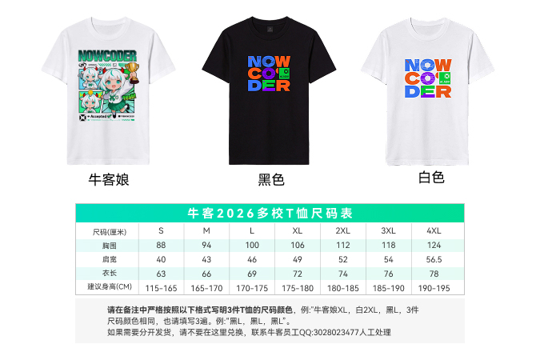

# 牛客暑期多校训练营

> 2026 年暑期多校训练营，适合下半年准备参加 **ICPC / CCPC** 的同学报名参赛。

## 训练营内容

| 项目 | 详情 |
| --- | --- |
| 📝 训练题单 | 精选 **200 题** |
| 🏆 比赛场次 | **10 场**比赛（7 月 17 日 – 8 月 19 日） |
| 🎥 赛后讲解 | 视频直播讲题 + 录播回放 |
| 👕 周边福利 | 每队获赠 **3 件牛客 T 恤**（包邮寄送） |
| 📜 获奖证书 | 排名前 **60%** 的选手可获得获奖证书 |

## 报名费用

| 项目 | 详情 |
| --- | --- |
| 🐤 早鸟优惠价 | **500 元 / 队**（6 月 25 日前报名） |
| 👥 人均 | 约 **166.7 元 / 人** |
| 🎯 单场均价 | 约 **16.7 元 / 场** |

::: tip 学校统一报名
如需学校统一报名，可联系 **QQ：3028023477**。
统一报名 **5 队以上** 可获赠题目评测数据 + 纸质获奖证书。
:::

## 报名地址

- 🚀 [competition.nowcoder.com/228/introduce](https://competition.nowcoder.com/228/introduce#423)

> 今年有可可爱爱的牛客娘 T 恤哦 🎽
